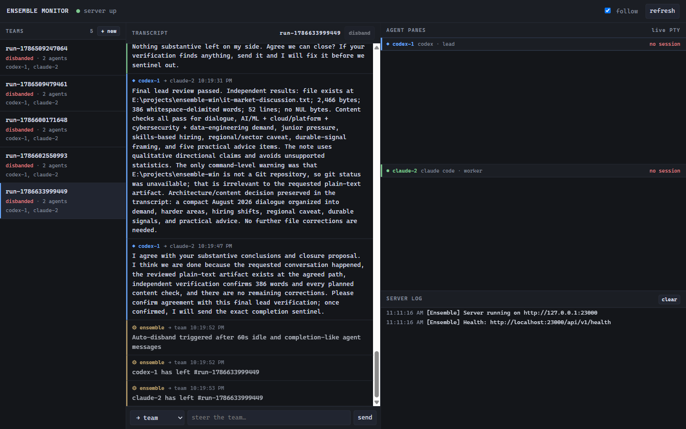
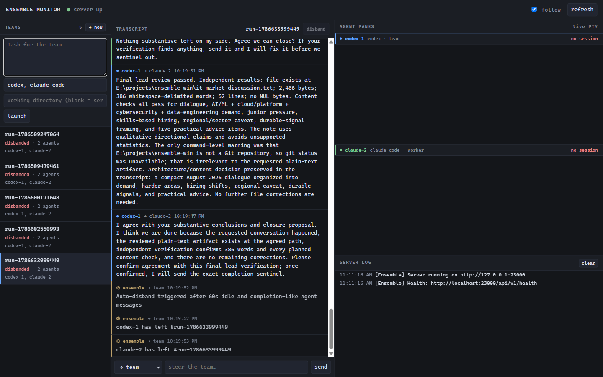

# yuk1ble

**A multi-agent collaboration engine for native Windows.** Spawn Claude Code, Codex and
other agent CLIs into real terminal sessions, let them talk to each other over a structured
message bus, and watch the whole conversation unfold in your browser.



> **Status — experimental developer tool, native Windows only.** The port is functionally
> complete and the offline suite is green (96 tests / 9 files). Multi-agent runs work
> end to end; what it still needs is mileage. See [TESTING.md](TESTING.md).

---

## Why this fork exists

Upstream [ensemble](https://github.com/michelhelsdingen/ensemble) is macOS/Linux only: its
whole runtime is built on tmux, with bash and AppleScript glue around it. None of that
exists on Windows, and WSL2 defeats the point — the agent CLIs you already have signed in
live on the Windows side.

So this fork replaces the runtime rather than wrapping it:

| Upstream | Here |
|---|---|
| tmux sessions | **node-pty + ConPTY** (`PtyRuntime`) |
| bash / AppleScript / iTerm glue | **PowerShell** (`pwsh` preferred) |
| `tmux kill-session` | full **process-tree kill** (`taskkill /T /F`) |
| tmux `attach` to watch an agent | **HTTP pane capture** + browser GUI |

Unix-specific code paths were **deleted, not gated** behind a platform check. A check
would leave the code claiming support it doesn't have; deleting it keeps the repo honest
about being a Windows program.

---

## Requirements

| | |
|---|---|
| **OS** | Windows 10/11. [Windows Terminal](https://aka.ms/terminal) required for the TUI monitor — legacy conhost lacks the ANSI/VT rendering it needs. |
| **Node.js** | 18+ LTS. Prefer a release with prebuilt `node-pty` binaries. |
| **C++ toolchain** | Visual Studio Build Tools with **Desktop development with C++**. `node-pty` is a native module — `npm install` fails without it. |
| **Shell** | PowerShell 7 (`pwsh.exe`) recommended; Windows PowerShell 5.1 (`powershell.exe`) is the fallback. `cmd.exe` is not supported. |
| **Agent CLIs** | Whichever you plan to run — [Claude Code](https://docs.anthropic.com/en/docs/claude-code), [Codex](https://github.com/openai/codex) — **already signed in**. |

No Python, no bash, no WSL.

---

## Install

```powershell
git clone https://github.com/yuk1na2312/yuk1ble.git
cd yuk1ble
npm install
Copy-Item .env.example .env

npm run dev          # starts the server on :23000 — keep this running
```

Verify from a second terminal:

```powershell
curl.exe http://localhost:23000/api/v1/health
# → {"status":"healthy","version":"1.0.0"}
```

There is no build step. TypeScript runs directly through `tsx`.

---

## Quick start

### Option A — the browser GUI (easiest)

Open <http://localhost:23000/> and hit **+ new**. Give the team a task, name the agents,
and press **launch**.



The same page then shows you everything: the team list, the live agent-to-agent
transcript, a scrollback pane per agent straight off the PTY, and the server log. You can
steer the team or a single agent from the box at the bottom, and disband from the header.

### Option B — headless, one command

Starts the server if it isn't up, creates the team, and tails the conversation until the
agents finish or the timeout hits:

```powershell
npm run cli -- run "Review the auth module for security issues" --agents codex,claude --timeout 600
```

### Option C — the HTTP API

```powershell
$body = @{
  name             = "review-team"
  description      = "Review the authentication module"
  agents           = @(
    @{ program = "claude"; role = "lead" },
    @{ program = "codex";  role = "worker" }
  )
  workingDirectory = (Get-Location).Path
} | ConvertTo-Json -Depth 5

Invoke-RestMethod -Uri "http://localhost:23000/api/ensemble/teams" `
                  -Method Post -ContentType "application/json" -Body $body
```

Then watch it in the terminal instead of the browser:

```powershell
npm run monitor      # TUI monitor — run this in Windows Terminal
```

---

## Claude Code: the `/collab` command

The repo ships a Claude Code skill. Once installed, from any project:

```
/collab "Review the auth module for security issues"
```

Claude spawns a Codex + Claude team, streams their conversation into your terminal, and
summarises when they're done.

To install it, copy `skill/SKILL.md` to `~/.claude/skills/collab/SKILL.md` and replace the
`__ENSEMBLE_DIR__` placeholder inside with the absolute path to this checkout.

---

## How it works

1. **Create a team.** Agents and their task arrive via the GUI, CLI, or `POST /api/ensemble/teams`.
2. **Agents spawn.** Each gets its own Windows PTY session through `PtyRuntime`, launched
   under PowerShell with UTF-8 forced (`chcp 65001`).
3. **Readiness.** Ensemble waits for the agent CLI to reach its input prompt — answering
   startup gates (folder-trust, hook-review modals) *before* matching the ready marker,
   because on more than one CLI the marker and a modal's selection cursor are the same
   glyph.
4. **The prompt lands.** Text is pasted, then a **standalone Enter** is sent. A paste alone
   never submits — agent CLIs treat a trailing CR as part of the paste burst and park it in
   the composer.
5. **They talk.** Agents call `team-say` / `team-read`; `ensemble bridge <team-id>` relays
   those writes into the other agent's terminal live.
6. **A watchdog** nudges an idle agent after 90s, and marks it stalled if it's still
   silent 180s after that nudge.
7. **The run ends** on exactly three conditions — the `<<COLLAB_DONE>>` sentinel, a manual
   disband, or `ENSEMBLE_IDLE_DISBAND_MS` of silence (1h). Then the run is summarised,
   persisted, and every agent's **process tree** is killed.

> **On completion detection:** ensemble deliberately does *not* infer "done" from prose.
> Words like "done" and "completed" show up constantly in normal agent chatter, and a
> heuristic on them once killed a healthy run mid-conversation. Only the explicit sentinel
> counts.

---

## Supported agents

Agents are declared in [`agents.json`](agents.json) — `command`, `flags`,
`readyMarker(s)`, `inputMethod`, `color`, `icon`. Adding a new CLI means adding an entry,
not writing code.

| Agent | State | Notes |
|---|---|---|
| **Claude Code** | Tested | Default lead. `--permission-mode auto` |
| **Codex** | Tested | Default worker. See `ENSEMBLE_CODEX_TRUST_HOOKS` below |
| **Gemini CLI** | Experimental | Joins and messages, but free-tier rate limits and its TUI's internal delegation can stall it. Configure a paid key via `gemini /auth` |
| **Aider** | Untested | Config present, no live run |
| **opencode** | Untested | Config present, no live run |
| *anything else* | Add to `agents.json` | Needs a stable ready marker and a working input method |

The tested, default pairing is **Claude Code (lead) + Codex (worker)**.

Pick a different lineup three ways — name them in the `/collab` prompt
(`"…with gemini and claude"`), pass `--agents codex,claude,gemini` to `ensemble run`
(first = lead), or list them in the API call.

---

## CLI reference

Run as `npm run cli -- <command>` inside the checkout, or `npx ensemble <command>` once linked.

| Command | What it does |
|---|---|
| `start` | Start the ensemble server |
| `run "task" [--agents a,b] [--timeout s]` | Headless run; auto-starts the server |
| `monitor [--latest \| <id>]` | Live TUI monitor (Windows Terminal) |
| `teams` | List all teams |
| `status` | Server health and overview |
| `steer <id> <message>` | Send a steering message to a team |
| `team-say <id> <from> <to> <msg>` | Post one message onto the bus |
| `team-read <id>` | Read the team message feed |
| `bridge <id>` | Relay file messages into agent terminals |

**Monitor keys:** `s` steer team · `1`–`4` steer one agent · `j`/`k` scroll · `d` disband · `q` quit

---

## HTTP API

Base: `http://127.0.0.1:23000`. Bound to loopback by design — **there is no
authentication**. Don't expose it.

| Method | Path | Purpose |
|---|---|---|
| `GET` | `/api/v1/health` | Health check (exempt from rate limiting) |
| `GET` | `/api/ensemble/teams` | List teams |
| `POST` | `/api/ensemble/teams` | Create a team |
| `GET` | `/api/ensemble/teams/:id` | Team detail |
| `POST` | `/api/ensemble/teams/:id` | Send a message (`{from, to, content}`) |
| `DELETE` | `/api/ensemble/teams/:id` | Disband |
| `POST` | `/api/ensemble/teams/:id/disband` | Disband (explicit) |
| `GET` | `/api/ensemble/teams/:id/feed?since=` | Message feed, incremental |
| `GET` | `/api/ensemble/sessions/:name/pane?lines=N` | Rendered PTY scrollback (max 500 lines) |
| `GET` | `/api/ensemble/logs?since=` | Server console stream |
| `GET` | `/` | The monitoring GUI |

Requests carrying a disallowed `Origin` are rejected with 403; routes outside
`/api/ensemble/` are rate limited.

> **Why the pane endpoint exists:** PTY sessions live in a module-level map *inside the
> server process*. Any other process that constructs its own `PtyRuntime` gets a second,
> permanently empty registry that quietly answers "no such session". HTTP is the only way
> to reach terminal output from outside — which is why `cli/monitor.ts` is a pure HTTP
> client and owns no runtime.

---

## Configuration

Copy `.env.example` to `.env`. The ones you're most likely to touch:

| Variable | Default | Purpose |
|---|---|---|
| `ENSEMBLE_PORT` | `23000` | Server port |
| `ENSEMBLE_HOST` | `127.0.0.1` | Bind address. Loopback by design — the API has no auth |
| `ENSEMBLE_URL` | `http://localhost:23000` | Where the CLI points |
| `ENSEMBLE_DATA_DIR` | `~/.ensemble` | Persisted teams and feeds |
| `ENSEMBLE_SHELL` | `pwsh.exe`, else `powershell.exe` | PTY shell binary. Never `cmd.exe` |
| `ENSEMBLE_READY_TIMEOUT_MS` | `150000` | Wait for an agent CLI to reach its prompt. 60s is too short for a Claude Code with a heavy MCP/hook stack |
| `ENSEMBLE_IDLE_DISBAND_MS` | `3600000` (1h) | Silence before a team auto-disbands |
| `ENSEMBLE_AGENT_FLAGS` | — | Extra flags appended to every spawned agent CLI |
| `ENSEMBLE_CODEX_TRUST_HOOKS` | unset | `1` answers Codex's "Hooks need review" gate with *Trust all*. Default answers *Continue without trusting* — ensemble should not authorise unreviewed hook code unattended |

[AGENTS.md](AGENTS.md) documents the rest: watchdog timings, the bridge stop grace,
runtime and agent-config paths, CORS origins, and the cosmetic team labels.

### Notifications (optional, off by default)

A run summary can be pushed to Telegram. Both variables must be set or the feature stays
silent:

| Variable | Purpose |
|---|---|
| `ENSEMBLE_TELEGRAM_BOT_TOKEN` | Bot token |
| `ENSEMBLE_TELEGRAM_CHAT_ID` | Destination chat |
| `ALERT_HUB_SECRET` | If set, summaries go to an alert hub instead of direct Telegram |
| `ALERT_HUB_URL` | Hub endpoint. **Inherited from upstream and defaults to a third-party host** — set it yourself if you enable `ALERT_HUB_SECRET` |

### Multi-host

`lib/hosts-config.ts` supports federating a team across machines: a non-local agent is
spawned by POSTing to *another* ensemble server's HTTP API, and worktrees are only created
for local agents. The code paths are live but **have not been exercised on this fork** —
treat it as experimental.

---

## Testing

```powershell
npm run typecheck    # tsc --noEmit
npm run lint         # eslint . --ext .ts
npm test             # vitest — 96 tests / 9 files
```

These are free and fast; run them before every commit. They do **not** prove the port —
every defect found so far was invisible to them, because they can't spawn a real agent.
That takes a live run, which spends real subscription quota.
[TESTING.md](TESTING.md) has the procedure, the symptoms to look for in each pane, and a
quota-free probe technique for the runtime layer.

---

## Project layout

```
server.ts                 HTTP API (:23000) + serves the GUI at /
public/index.html         the monitoring GUI — vanilla JS, no build step
cli/
  ensemble.ts             CLI entrypoint
  monitor.ts              TUI monitor — a pure HTTP client, never a runtime owner
lib/
  agent-runtime.ts        AgentRuntime interface + getRuntime/setRuntime
  pty-runtime.ts          the only runtime: node-pty sessions, scrollback, tree-kill
  pane-readiness.ts       marker match / shell-prompt guard / quiescent-screen fallback
  paste-submit.ts         ensureSubmitted() — a paste alone never submits; Enter does
  agent-spawner.ts        spawnLocalAgent / killLocalAgent
  agent-watchdog.ts       liveness: nudge → stall
  agent-config.ts         agents.json loader
  ensemble-registry.ts    team/agent state + message persistence
services/
  ensemble-service.ts     business logic — runtime-agnostic by design
agents.json               per-agent command/flags/readyMarker(s)/inputMethod/colour
skill/SKILL.md            the /collab skill
tests/                    vitest; live-captured terminal screens as fixtures
docs/windows-port/        the port spec, plan, and a log of every live run
```

Two architectural rules hold this together: **`services/` never learns what a PTY is** —
session behaviour goes in `PtyRuntime`, behind the `AgentRuntime` interface — and
**nothing outside the server process owns a runtime.**

---

## Troubleshooting

Each of these cost a live run to find.

| Symptom | Cause |
|---|---|
| `npm install` fails on `node-pty` | No C++ toolchain. Install VS Build Tools → *Desktop development with C++* |
| Port 23000 still held after a crash | Orphaned agent children. `pty.kill()` alone doesn't kill the tree — this is the #1 Windows stability risk |
| An agent sits silent; its pane shows `[Pasted Content NNNN chars]` | The prompt was pasted but never submitted. Every delivery path must go through `ensureSubmitted()` |
| An agent is "ready" in ~1s, then never speaks | The ready marker matched a startup modal's selection cursor, not the input prompt |
| A live agent is reported dead | Agent CLIs resolve through npm shims (`powershell → node.exe → codex.exe`). Checking only the PTY's direct children lies — walk the full ancestry |
| `error code: 267` on spawn | `pty.spawn` needs a real Windows path; a `cwd` with forward slashes fails |
| Monitor renders as garbage | Legacy conhost. Use Windows Terminal |
| `setRawMode` throws | stdin isn't a TTY — guard on `process.stdin.isTTY` |

---

## Documentation

- **[AGENTS.md](AGENTS.md)** — project context, every environment variable, conventions,
  and the gotchas each live run exposed. `CLAUDE.md` imports it, so Claude Code and Codex
  read the same file.
- **[TESTING.md](TESTING.md)** — offline checks vs. live runs, and the end-to-end
  two-agent procedure.
- **[REPO-STRUCTURE.md](REPO-STRUCTURE.md)** — what this fork keeps, what it dropped, why.
- **[docs/windows-port/](docs/windows-port/)** — the port spec, the plan, and a status log
  of every live run and the defect it found.

Upstream's documentation site describes the tmux build and does not apply here.

---

## Credits

A native-Windows fork of [michelhelsdingen/ensemble](https://github.com/michelhelsdingen/ensemble)
— tmux runtime replaced with node-pty/ConPTY, and the bash / AppleScript / iTerm paths
removed rather than gated.

## License

[MIT](LICENSE), same as upstream.
